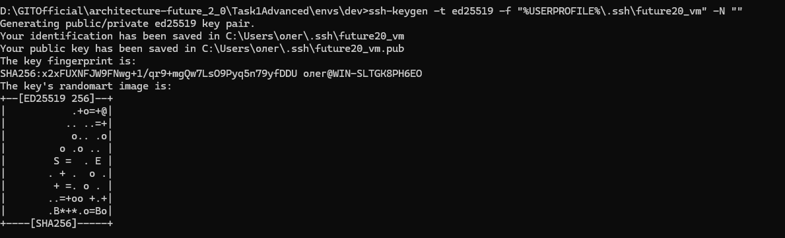
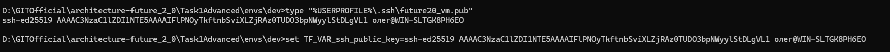
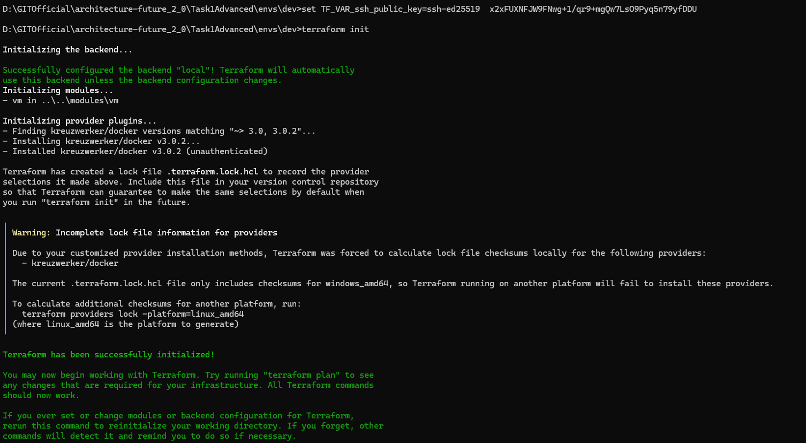
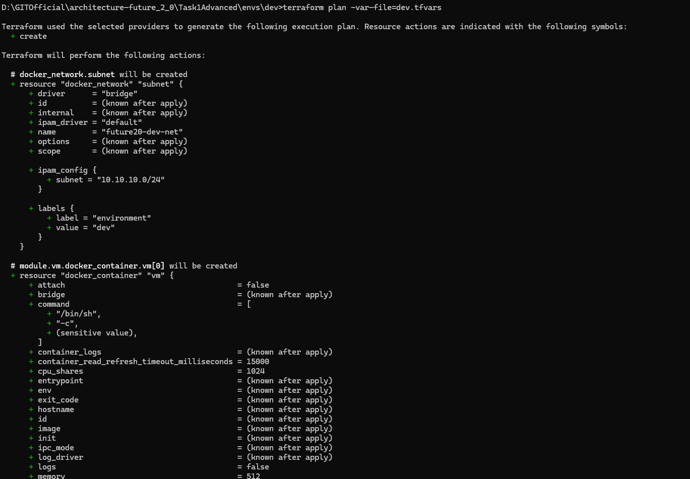
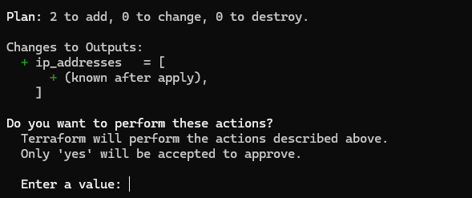
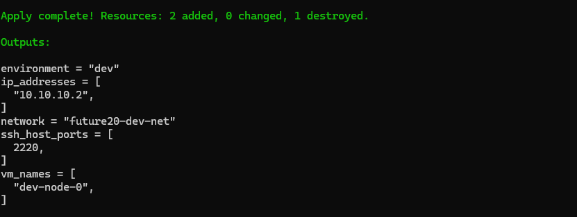
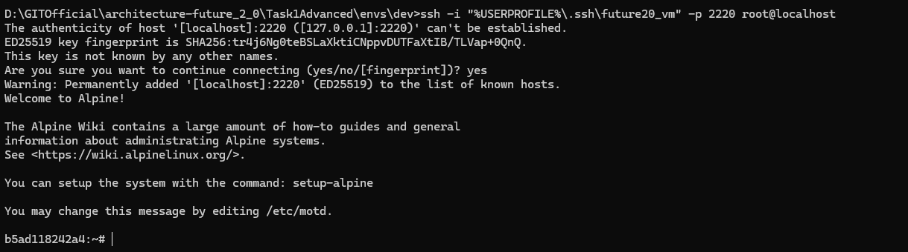
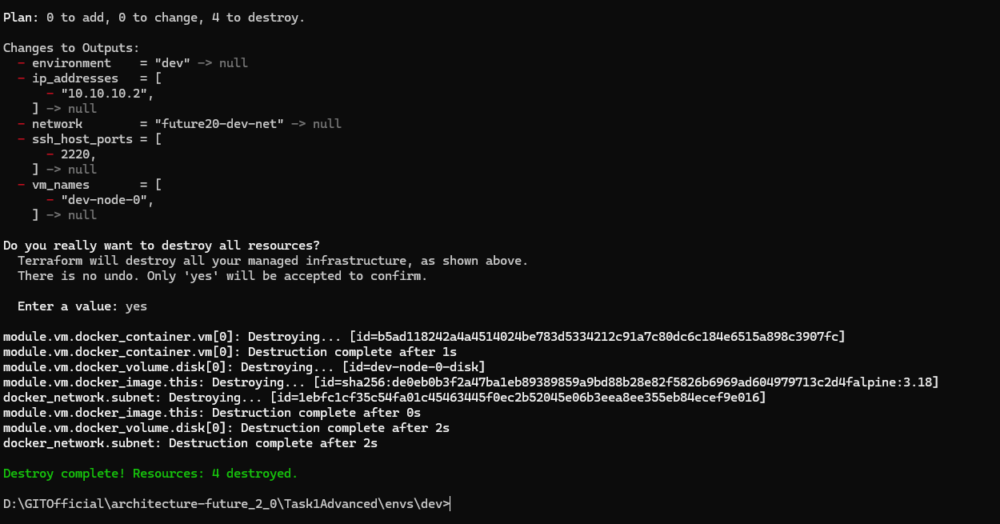

# Задание 1. Модульная инфраструктура для нескольких сред

Универсальный Terraform-модуль для создания виртуальных машин с подключаемым диском, сетевым интерфейсом и SSH-доступом. Модуль используется в трёх окружениях: **dev**, **stage**, **prod**, каждое со своей конфигурацией, передаваемой через отдельный `.tfvars`-файл.

Виртуальные машины смоделированы **Docker-контейнерами** (провайдер `kreuzwerker/docker`).

## Структура репозитория

```
Task1Advanced/
├── modules/
│   └── vm/                  # переиспользуемый модуль ВМ
│       ├── main.tf          # ресурсы: контейнер, том (диск), образ
│       ├── variables.tf     # входные параметры (cores, memory, disk, subnet и др.)
│       ├── outputs.tf       # выходы: id, ip, имена ВМ и дисков, порты SSH
│       └── versions.tf      # требования к провайдеру и версии Terraform
├── envs/                    # окружения
│   ├── dev/
│   │   ├── main.tf          # создание сети и вызов модуля
│   │   ├── variables.tf     # описание переменных окружения
│   │   ├── outputs.tf       # проброс выходов модуля
│   │   ├── dev.tfvars       # значения для dev
│   │   └── versions.tf      # настройка провайдера и бэкенда
│   ├── stage/               # аналогично dev, но со своими значениями
│   │   ├── main.tf
│   │   ├── variables.tf
│   │   ├── outputs.tf
│   │   ├── stage.tfvars
│   │   └── versions.tf
│   └── prod/                # аналогично dev/stage
│       ├── main.tf
│       ├── variables.tf
│       ├── outputs.tf
│       ├── prod.tfvars
│       └── versions.tf
└── README.md                # этот файл
```

## Краткое описание работы модуля

Модуль `modules/vm` создаёт для каждой ВМ:

- **docker_container** - контейнер на базе образа `alpine:3.18` с установленным SSH-сервером. При старте контейнера генерируются host-ключи SSH, устанавливается пароль для пользователя `root`, разрешается вход по паролю.
- **docker_volume** - том, монтируемый в контейнер как подключаемый диск (путь `/data`). Размер диска указывается в метках тома для информационных целей.
- Контейнер подключается к **docker_network**, созданной на уровне окружения (subnet).  
- SSH-доступ пробрасывается на хост-машину: порт 22 контейнера маппится на внешний порт, начиная с указанного в переменной `ssh_host_port` (для первой ВМ - этот порт, для второй - порт +1 и т.д.).  
- Параметры, соответствующие заданию:
  - **Количество ядер** - регулируется через `cpu_shares` (вес CPU) и отображается в метках контейнера.
  - **Объём RAM** - задаётся в мегабайтах через `memory`.
  - **Подключаемый диск** - отдельный том Docker, монтируемый в `/data`.
  - **Subnet ID** - имя сети, передаваемое в модуль из окружения.
  - **SSH-ключ** - публичный ключ передаётся через переменную `ssh_public_key` (рекомендуется задавать через переменную окружения `TF_VAR_ssh_public_key`, чтобы не хранить секрет в репозитории).

## Входные параметры модуля (`modules/vm/variables.tf`)

| Переменная        | Тип           | Обяз. | По умолчанию  | Описание                                                                     |
|-------------------|---------------|-------|---------------|------------------------------------------------------------------------------|
| `vm_name`         | `string`      | да    | -             | Базовое имя ВМ (к нему добавляется индекс).                                  |
| `vm_count`        | `number`      | нет   | `1`           | Количество одинаковых ВМ.                                                    |
| `image`           | `string`      | нет   | `alpine:3.18` | Docker-образ для ВМ.                                                         |
| `cores`           | `number`      | да    | -             | Количество ядер CPU (влияет на `cpu_shares`).                                |
| `memory_mb`       | `number`      | да    | -             | Объём RAM в мегабайтах.                                                      |
| `disk_size_gb`    | `number`      | нет   | `10`          | Заявленный размер диска в ГБ (сохраняется в метках тома).                    |
| `disk_mount_path` | `string`      | нет   | `/data`       | Путь монтирования диска внутри ВМ.                                           |
| `subnet_id`       | `string`      | да    | -             | Имя сети Docker, к которой подключается ВМ.                                  |
| `ssh_host_port`   | `number`      | нет   | `2222`        | Начальный порт хоста для проброса SSH.                                       |
| `ssh_public_key`  | `string`      | да    | -             | Публичный SSH-ключ (sensitive). Рекомендуется через `TF_VAR_ssh_public_key`. |
| `labels`          | `map(string)` | нет   | `{}`          | Дополнительные метки для контейнера.                                         |

## Выходные данные модуля (`modules/vm/outputs.tf`)

| Имя              | Описание                                                         |
|------------------|------------------------------------------------------------------|
| `vm_ids`         | Список идентификаторов созданных контейнеров.                    |
| `vm_names`       | Список имён контейнеров.                                         |
| `ip_addresses`   | Список IP-адресов ВМ внутри заданной сети.                       |
| `disk_ids`       | Список идентификаторов томов (дисков).                           |
| `disk_names`     | Список имён томов.                                               |
| `ssh_host_ports` | Список портов хоста, на которые проброшен SSH (по одному на ВМ). |

## Конфигурации окружений

| Параметр           | dev                           | stage                         | prod                          |
|--------------------|-------------------------------|-------------------------------|-------------------------------|
| Имя окружения      | `dev`                         | `stage`                       | `prod`                        |
| Подсеть            | `10.10.10.0/24`               | `10.10.20.0/24`               | `10.10.30.0/24`               |
| Имя ВМ             | `dev-node`                    | `stage-node`                  | `prod-node`                   |
| Количество ВМ      | 1                             | 2                             | 3                             |
| Ядра               | 1                             | 2                             | 4                             |
| RAM (МБ)           | 512                           | 1024                          | 2048                          |
| Диск (ГБ)          | 10                            | 20                            | 40                            |
| Начальный порт SSH | 2220                          | 2230                          | 2240                          |
| SSH-ключ           | через `TF_VAR_ssh_public_key` | через `TF_VAR_ssh_public_key` | через `TF_VAR_ssh_public_key` |

Значения параметров (кроме SSH-ключа) задаются в соответствующих `*.tfvars`-файлах. Публичный SSH-ключ передаётся через переменную окружения - это исключает попадание секрета в репозиторий.
## Инструкция по запуску

### Требования

- Установленный [Terraform](https://www.terraform.io/downloads) (>= 1.6.0)
- Установленный [Docker](https://docs.docker.com/get-docker/) (демон запущен)
- Для использования образа `alpine:3.18` его необходимо предварительно загрузить в локальный Docker-демон:
- Сгенерированная пара SSH-ключей (см. ниже)

  ```bash
  docker pull alpine:3.18
  ```
Если среда без доступа к Docker Hub, перенесите образ любым удобным способом (например, через `docker save`/`docker load`).

### Генерация SSH-ключей

**На Windows (встроенный OpenSSH):**
```powershell
ssh-keygen -t ed25519 -f "%USERPROFILE%\.ssh\future20_vm" -N ""
```


### 1. Выбор окружения

Перейдите в папку нужного окружения и задайте переменную с публичным ключом:

```bash
cd envs/dev
type "%USERPROFILE%\.ssh\future20_vm.pub"
set TF_VAR_ssh_public_key=ssh-ed25519 AAAAC3NzaC1lZDI1NTE5AAAAIFlPNOyTkftnbSviXLZjRAz0TUDO3bpNWyylStDLgVL1 олег@WIN-SLTGK8PH6EO
```


### 2. Инициализация Terraform

```bash
terraform init
```

### 3. Просмотр плана

```bash
terraform plan -var-file=dev.tfvars
```

### 4. Применение конфигурации

```bash
terraform apply -var-file=dev.tfvars
```

Подтвердите, введя `yes`. 


После успешного выполнения в выводе появятся IP-адреса созданных ВМ и порты SSH.


### 5. Подключение по SSH

Используйте любой SSH-клиент, указав порт и пароль из `.tfvars`:

```bash
ssh -i "%USERPROFILE%\.ssh\future20_vm" -p 2220 root@localhost
```

Для `stage` и `prod` действия аналогичны, только замените `dev` на `stage` или `prod` и используйте соответствующий `.tfvars`.

### 6. Удаление окружения

```bash
terraform destroy -var-file=dev.tfvars
```
