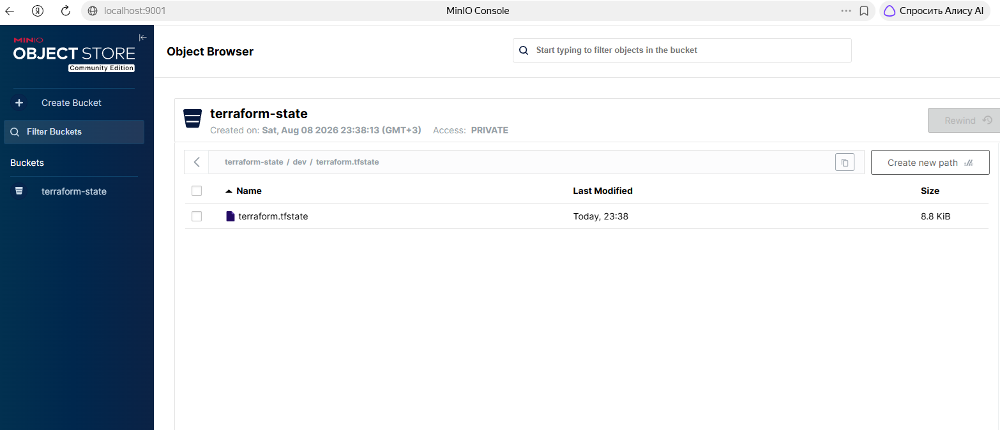
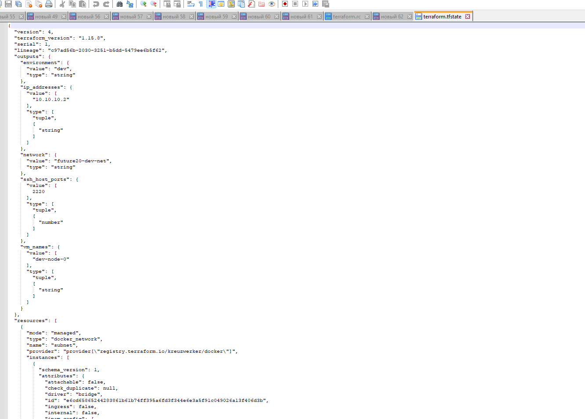

# Задание 2. Интеграция с CI/CD и удалённым хранением состояния

Решение автоматизирует развёртывание инфраструктуры из Task1Advanced с помощью **GitHub Actions**.
Состояние Terraform хранится в S3-совместимом хранилище **MinIO**, что исключает
локальное хранение и позволяет команде работать совместно.

## Что внутри

- **Модуль `vm`** – универсальный модуль ВМ (Docker-контейнер) из Task1Advanced.
- **Три окружения** (`dev`, `stage`, `prod`) – каждое со своим `backend` в MinIO и
  изолированным ключом состояния.
- **CI/CD пайплайн** (`.github/workflows/terraform.yml`) – автоматический `plan` при
  pull request, `apply` при push в `main` или вручную.

## Структура репозитория

```
Task2Advanced/
├── modules/vm/                  # модуль ВМ
│   ├── main.tf
│   ├── variables.tf
│   ├── outputs.tf
│   └── versions.tf
├── envs/
│   ├── dev/                     # main.tf, variables.tf, outputs.tf, versions.tf, dev.tfvars
│   ├── stage/                   # аналогично
│   └── prod/                    # аналогично
├── .github/workflows/
│   └── terraform.yml            # пайплайн GitHub Actions
├── test.bat                     # локальный запуск MinIO, init, plan, apply
└── README.md
```

## Удалённое хранение состояния (Backend)

Каждое окружение использует backend `s3`. Параметры подключения передаются через
`-backend-config`, а ключи состояния изолированы:
- `dev/terraform.tfstate`
- `stage/terraform.tfstate`
- `prod/terraform.tfstate`

Все чувствительные данные не хранятся в коде и передаются через переменные окружения
или секреты GitHub.

## Локальная разработка и тестирование

Для локального запуска необходим Docker и Terraform ≥ 1.6.

### Для быстрой проверки выполните(dev):
```cmd
test.bat
```
Скрипт:
- поднимет MinIO в Docker,
- создаст бакет terraform-state,
- выполнит terraform init и plan для окружения dev,
- запросит подтверждение и, если ответить Y, применит изменения (apply).
- После перейти в Minio и убедиться в наличии terraform.tfstate

Следующего содержимого

### Пошаговая проверка:
1. **Запустите MinIO** (если ещё не запущен):
   ```bash
   docker run -d --name minio \
     -p 9000:9000 -p 9001:9001 \
     -e MINIO_ROOT_USER=admin \
     -e MINIO_ROOT_PASSWORD=admin123 \
     quay.io/minio/minio server /data --console-address ":9001"
   ```
2. Создайте бакет `terraform-state` через веб-интерфейс http://localhost:9001 или CLI.
3. Установите переменные окружения (пример для Windows cmd):
   ```cmd
   set TF_VAR_minio_endpoint=http://localhost:9000
   set TF_VAR_minio_bucket=terraform-state
   set TF_VAR_minio_access_key=admin
   set TF_VAR_minio_secret_key=admin123
   set TF_VAR_ssh_password=testpass
   ```
4. Перейдите в папку окружения и выполните:
   ```bash
   cd envs/dev
   terraform init \
     -backend-config="endpoint=%TF_VAR_minio_endpoint%" \
     -backend-config="bucket=%TF_VAR_minio_bucket%" \
     -backend-config="access_key=%TF_VAR_minio_access_key%" \
     -backend-config="secret_key=%TF_VAR_minio_secret_key%"
   terraform plan -var-file=dev.tfvars
   terraform apply -auto-approve -var-file=dev.tfvars
   ```

   Аналогично для `stage` и `prod`.

5. **Быстрый тест:** запустите `test.bat` в корне репозитория – он поднимет MinIO,
   создаст бакет, выполнит `init`, `plan` и (после вашего подтверждения) `apply`.
   После успешного `apply` состояние появится в MinIO.

## CI/CD пайплайн (GitHub Actions)

Пайплайн описан в `.github/workflows/terraform.yml` и содержит три job:

| Job               | Событие             | Действие                                           |
|-------------------|---------------------|----------------------------------------------------|
| `terraform-plan`  | `pull_request`      | `plan` для dev, stage, prod (ephemeral MinIO)      |
| `terraform-apply` | `push` в `main`     | `apply` для всех окружений (ephemeral MinIO)       |
| `manual-deploy`   | `workflow_dispatch` | ручной `plan` или `apply` для выбранного окружения |

Во всех job'ах MinIO запускается как сервисный контейнер, поэтому внешние секреты
не требуются. Только `SSH_PASSWORD` должен быть добавлен в GitHub Secrets, если
модуль ВМ требует пароль.

## Безопасность

- Ключи и пароли не хранятся в репозитории.
- В CI/CD используется ephemeral MinIO – состояние живёт только во время джобы.
- Для production‑окружения можно настроить `environment` с обязательными ревьюверами.

## Как развернуть в своём репозитории

1. Скопируйте содержимое `Task2Advanced` в ваш репозиторий.
2. В GitHub Secrets добавьте `SSH_PASSWORD` (пароль для ВМ).
3. Создайте Pull Request – автоматически запустится `plan`.
4. После слияния в `main` выполнится `apply`.