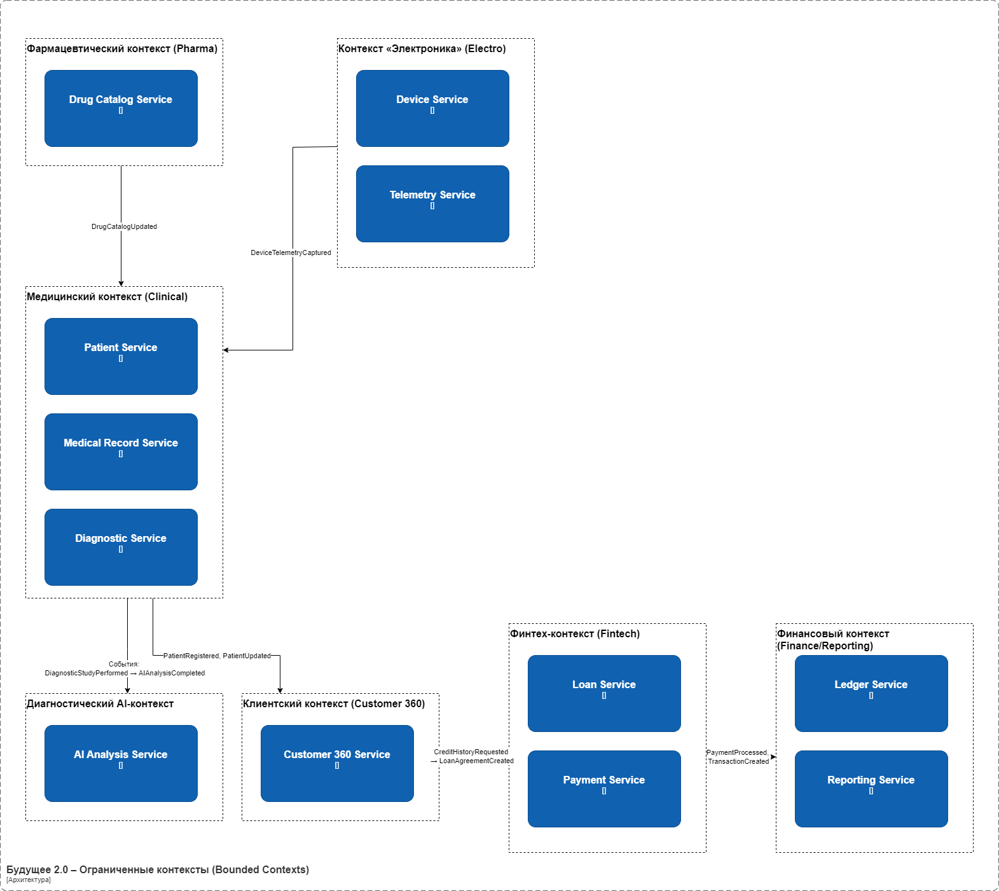
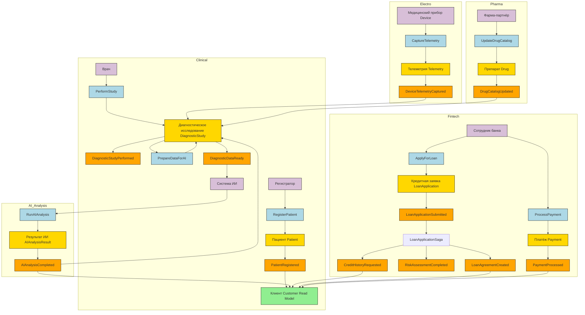

# Задание 4. Моделирование домена и интеграций

## 1. Диаграмма ограниченных контекстов (Bounded Contexts)

## 2. Ключевые агрегаты

### Медицинский контекст (Clinical)
- **Пациент (Patient)**
    - Границы: ФИО, дата рождения, контакты, идентификаторы.
    - Инварианты: Уникальность ID, обязательность полей ФИО.
    - Ключ: PatientId.
- **Медицинская карта (MedicalRecord)**
    - Границы: диагнозы, назначения, история приёмов.
    - Инварианты: Привязка к существующему пациенту, целостность записей.
    - Ключ: RecordId.
- **Диагностическое исследование (DiagnosticStudy)**
    - Границы: тип исследования, результаты, дата, врач.
    - Инварианты: Связь с картой и пациентом.
    - Ключ: StudyId.

### Диагностический AI-контекст (Diagnostics AI)
- **Результат ИИ-анализа (AIAnalysisResult)**
    - Границы: идентификатор исследования, вывод, уверенность модели, рекомендации.
    - Инварианты: Ссылка на DiagnosticStudy.
    - Ключ: AnalysisId.

### Финтех-контекст (Fintech)
- **Кредитный договор (LoanAgreement)**
    - Границы: сумма, срок, ставка, статус.
    - Инварианты: Положительная сумма, корректный срок.
    - Ключ: LoanId.
    - **Паттерн хранения:** Event Sourcing (полный аудит изменений договора).
- **Платёж (Payment)**
    - Границы: сумма, дата, контрагент.
    - Инварианты: Привязка к счёту/договору.
    - Ключ: PaymentId.

### Клиентский контекст (Customer 360)
- **Клиент (Customer)**
    - Границы: ФИО, сегмент, кредитная история, предпочтения.
    - Инварианты: Уникальность ID, целостность связей с другими доменами.
    - Ключ: CustomerId.

### Финансовый контекст (Finance/Reporting)
- **Финансовая проводка (LedgerEntry)**
    - Границы: дебет, кредит, сумма, дата.
    - Инварианты: Балансовая эквивалентность.
    - Ключ: EntryId.
    - **Паттерн хранения:** Event Sourcing (аудиторский след всех транзакций).

### Фармацевтический контекст (Pharma)
- **Препарат (Drug)**
    - Границы: название, производитель, дозировка, цена.
    - Инварианты: Уникальность кода препарата.
    - Ключ: DrugId.

### Контекст «Электроника» (Electro)
- **Устройство (Device)**
    - Границы: серийный номер, тип, статус, принадлежность к клинике.
    - Инварианты: Уникальность серийного номера.
    - Ключ: DeviceId.
- **Телеметрия (Telemetry)**
    - Границы: показания датчиков, временная метка, идентификатор устройства.
    - Инварианты: Привязка к существующему устройству.
    - Ключ: TelemetryId.

## 3. Каталог доменных событий и Sagas

| Событие                    | Команда-триггер        | Источник (контекст)    | Подписчики                           | Описание                        | Ключевые поля                               |
|----------------------------|------------------------|------------------------|--------------------------------------|---------------------------------|---------------------------------------------|
| `PatientRegistered`        | `RegisterPatient`      | Медицинский (Clinical) | Customer 360                         | Регистрация нового пациента     | patientId, fullName, birthDate              |
| `PatientUpdated`           | `UpdatePatient`        | Медицинский (Clinical) | Customer 360                         | Обновлены данные пациента       | patientId, changes                          |
| `DiagnosticStudyPerformed` | `PerformStudy`         | Медицинский (Clinical) | Диагностический AI                   | Проведено исследование          | studyId, patientId, studyType               |
| `DiagnosticDataReady`      | `PrepareDataForAI`     | Медицинский (Clinical) | Диагностический AI                   | Данные подготовлены для ИИ      | studyId, patientId                          |
| `AIAnalysisCompleted`      | `RunAIAnalysis`        | Диагностический AI     | Медицинский (Clinical), Customer 360 | ИИ завершил анализ              | analysisId, studyId, conclusion, confidence |
| `LoanApplicationSubmitted` | `ApplyForLoan`         | Финтех (Lending)       | LoanApplicationSaga                  | Подана заявка на кредит         | applicationId, customerId, amount           |
| `CreditHistoryRequested`   | `RequestCreditHistory` | LoanApplicationSaga    | Customer 360                         | Запрос кредитной истории        | customerId, applicationId                   |
| `RiskAssessmentCompleted`  | `AssessRisk`           | Финтех (Risk)          | LoanApplicationSaga                  | Оценка рисков завершена         | applicationId, score                        |
| `LoanAgreementCreated`     | `CreateLoan`           | LoanApplicationSaga    | Customer 360, Финансовый             | Кредитный договор создан        | loanId, applicationId, amount, term         |
| `PaymentProcessed`         | `ProcessPayment`       | Финтех (Payments)      | Финансовый, Customer 360             | Платёж проведён                 | paymentId, loanId, amount, date             |
| `FinancialReportGenerated` | `GenerateReport`       | Финансовый (Finance)   | Регуляторы                           | Сформирован отчёт               | reportId, period, type                      |
| `DrugCatalogUpdated`       | `UpdateDrugCatalog`    | Фармацевтический       | Медицинский                          | Обновлён каталог препаратов     | drugId, action (add/update/delete)          |
| `DeviceTelemetryCaptured`  | `CaptureTelemetry`     | Электроника            | Медицинский                          | Получены телеметрические данные | deviceId, timestamp, metrics                |

### Sagas / Process Managers

**LoanApplicationSaga (Финтех)**
- **Триггер:** `LoanApplicationSubmitted`
- **Шаги:**
    1. Проверить кредитную историю (`CreditHistoryRequested`)
    2. Оценить риски (`RiskAssessmentCompleted`)
    3. Создать договор (`LoanAgreementCreated`)
    4. Уведомить клиента
- **Компенсация:** при отказе - откатить резервирование средств

**TreatmentSaga (Медицинский)**
- **Триггер:** `AppointmentScheduled`
- **Шаги:**
    1. Запросить историю болезни
    2. Запустить ИИ-анализ (`DiagnosticDataReady`)
    3. Получить результат (`AIAnalysisCompleted`)
    4. Назначить лечение

## 4. Event Storming-диаграмма

## 5. Обоснование событийного подхода и Anti-Corruption Layer

### Текущие проблемы (Camel + DWH)
- **Жёсткая синхронная связь**: интеграции через ESB Camel реализованы точечно и требуют согласованных изменений в каждом сервисе при добавлении новых направлений.
- **Бизнес-логика в DWH**: значительная часть логики отчётности и трансформаций встроена в хранилище, что замедляет time‑to‑market новых продуктов и усложняет поддержку.
- **Пакетная обработка**: отчёты строятся часами из‑за объёмных ETL‑процессов, не позволяя оперативно реагировать на события.
- **Единая точка отказа**: выход из строя DWH или шины останавливает обмен данными.
- **Сложность масштабирования**: добавление нового бизнес‑направления требует глубокой переработки общей модели данных и логики в DWH.

### Anti-Corruption Layer (ACL) - защита новых доменов от легаси

ACL выступает переводчиком между старыми моделями данных DWH и новыми доменными моделями. Он изолирует новые домены от устаревших структур и логики, позволяя мигрировать систему постепенно:

- **Защита инвариантов:** легаси-данные трансформируются перед попаданием в новые домены, сохраняя их целостность.
- **Изоляция изменений:** модификации в DWH не влияют на контракты новых доменов - ACL скрывает их за стабильными интерфейсами.
- **Постепенная миграция:** данные вычитываются из DWH через CDC (Debezium) и публикуются как события. Например, `Customer 360` получает `PatientRegistered` от ACL, который адаптирует старую таблицу `tbl_patients` к новому контракту.
- **Снижение рисков:** при ошибках или паузах в миграции ACL временно накапливает изменения в очереди, не нарушая работу новых сервисов.

### Почему событийный подход (Event-Driven) лучше

- **Слабая связанность:** домены общаются через асинхронные события, не зависят от реализации друг друга. Новый домен просто начинает публиковать и подписываться на события без изменений в существующих системах.
- **Быстрая реакция:** переход от batch к near-real-time через Kafka и потоковые витрины позволяет получать аналитику в реальном времени.
- **Независимое масштабирование:** каждый домен масштабируется отдельно, а нагрузка на шину событий балансируется партиционированием.
- **Устойчивость:** при отказе одного домена события сохраняются в Kafka и доставляются позже.
- **Ускорение time‑to‑market:** Data Mesh и Self‑service BI позволяют бизнес‑пользователям самостоятельно строить отчёты поверх событийных потоков.

### Сравнение в таблице

| Критерий                      | Текущее состояние (Camel + DWH) | Целевое состояние (Kafka + Data Mesh) |
|-------------------------------|---------------------------------|---------------------------------------|
| Связанность                   | Высокая (синхронные вызовы)     | Низкая (асинхронные события)          |
| Скорость реакции              | Часы (batch‑отчёты)             | Секунды (потоковая обработка)         |
| Гибкость                      | Низкая                          | Высокая (домены независимы)           |
| Масштабируемость              | Вертикальная, сложная           | Горизонтальная, простая               |
| Отказоустойчивость            | Единая точка отказа             | Распределённая, с гарантией доставки  |
| Подключение новых направлений | Требует переработки DWH         | Публикация/подписка на события        |
| Защита от легаси-моделей      | Отсутствует                     | ACL + трансляция контрактов           |
