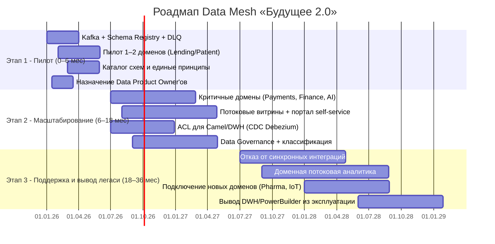

# Стратегический роадмап внедрения Data Mesh

Роадмап перехода «Будущего 2.0» к событийной платформе с Data Mesh. Этапы синхронизированы с дорожной картой компании.

## Ключевые роли

| Роль               | Ответственность                                    |
|--------------------|----------------------------------------------------|
| Data Product Owner | Владелец доменного data product, SLA, контракт     |
| Data Engineer      | Пайплайны, потоковые витрины, CDC                  |
| BI-аналитик        | Отчёты, семантический слой, обучение пользователей |
| Platform Team      | Kafka, Schema Registry, IaC, observability         |
| Data Governance    | Классификация данных, доступы, приватность         |

## Этапы

## Этапы и привязка к бизнес-целям

| Этап                | Сроки      | Ключевые действия                                                               | Бизнес-цель                                                                    |
|---------------------|------------|---------------------------------------------------------------------------------|--------------------------------------------------------------------------------|
| **Пилот**           | 0–6 мес.   | Запуск Kafka + Schema Registry, пилот 1–2 доменов, назначение DPO               | Промежуточное состояние - архитектура согласована, границы определены          |
| **Масштабирование** | 6–18 мес.  | Критичные домены, потоковые витрины, портал self-service, ACL, Data Governance  | Финальное состояние - портал, бизнес-пользователи работают в новой архитектуре |
| **Поддержка**       | 18–36 мес. | Отказ от синхронных интеграций, потоковая аналитика, новые домены, вывод легаси | Долгосрочная цель - масштабирование по продуктам, географии и данным           |

## Критерии перехода
- **Э1 → Э2:** пилотный домен публикует/потребляет события, DLQ работает, каталог схем заполнен.
- **Э2 → Э3:** критические домены на потоковых витринах, портал в проде, ACL закрывает легаси.
- **Завершение Э3:** синхронные интеграции убраны, DWH/PowerBuilder выведены, новые домены подключаются как data products.