# Расширенный технический радар «Будущее 2.0»

Радар включает **технологии** и **архитектурные паттерны**.

## Статусы
- **Adopt** - применяем по умолчанию, проверено.
- **Trial** - внедряем в пилотах, набираем опыт.
- **Assess** - изучаем, решение не принято.
- **Hold** - выводим из эксплуатации.

```mermaid
flowchart LR
    classDef adopt fill:#d1e7dd,stroke:#198754,color:#000;
    classDef trial fill:#cfe2ff,stroke:#0d6efd,color:#000;
    classDef assess fill:#fff3cd,stroke:#ffc107,color:#000;
    classDef hold fill:#fce8e6,stroke:#d93025,color:#000;

    subgraph ADOPT["🟢 Adopt"]
        direction LR
        a1[Event-Driven Architecture]:::adopt
        a2[Anti-Corruption Layer]:::adopt
        a3[Data Contracts / Schema Registry]:::adopt
        a4[DLQ]:::adopt
        a5[Apache Kafka]:::adopt
        a6[Terraform / IaC]:::adopt
        a7[Kubernetes]:::adopt
        a8[Go / Java / Python]:::adopt
    end
    subgraph TRIAL["🔵 Trial"]
        direction LR
        t1[Data Mesh]:::trial
        t2[Self-Service BI]:::trial
        t3[Lakehouse / Iceberg]:::trial
        t4[CDC / Debezium]:::trial
        t5[dbt]:::trial
        t6[ClickHouse]:::trial
        t7[Flink / Kafka Streams]:::trial
        t8[DataHub / OpenMetadata]:::trial
        t9[Great Expectations]:::trial
    end
    subgraph ASSESS["🟡 Assess"]
        direction LR
        s1[Event Sourcing]:::assess
        s2[CQRS]:::assess
        s3[Trino]:::assess
        s4[Superset / Metabase]:::assess
        s5[Feature Store]:::assess
        s6[Dagster]:::assess
    end
    subgraph HOLD["🔴 Hold"]
        direction LR
        h1[DWH SQL Server 2008]:::hold
        h2[PowerBuilder]:::hold
        h3[ESB Apache Camel]:::hold
        h4[Power BI кастомизации]:::hold
        h5[Точечные синхр. интеграции]:::hold
    end
```

## Квадранты (ThoughtWorks Tech Radar)

- **Паттерны и техники** - архитектурные подходы и методологии
- **Платформы** - инфраструктура и среды выполнения
- **Инструменты** - утилиты для разработки и эксплуатации
- **Языки и фреймворки** - технологии реализации

### Квадрант 1 - Паттерны и техники

| Блип                             | Кольцо     | Обоснование                                   |
|----------------------------------|------------|-----------------------------------------------|
| Event-Driven Architecture        | **Adopt**  | Базовый паттерн целевой платформы             |
| Anti-Corruption Layer            | **Adopt**  | Изоляция от легаси на время миграции          |
| Data Contracts / Schema Registry | **Adopt**  | Версионирование событий, совместимость        |
| DLQ                              | **Adopt**  | Обработка ошибочных событий                   |
| Data Mesh                        | **Trial**  | Владение доменов данными, поэтапное внедрение |
| Self-Service BI                  | **Trial**  | Портал с конструктором отчётов                |
| CDC (Change Data Capture)        | **Trial**  | Бесконтактная миграция из DWH                 |
| Event Sourcing                   | **Assess** | Для аудита финансовых операций                |
| CQRS                             | **Assess** | Для доменов с интенсивным чтением             |

### Квадрант 2 - Платформы

| Блип                            | Кольцо     | Обоснование                        |
|---------------------------------|------------|------------------------------------|
| Apache Kafka                    | **Adopt**  | Единая шина событий                |
| Kubernetes                      | **Adopt**  | Оркестрация сервисов в облаке      |
| Object Storage (S3-совместимое) | **Adopt**  | Хранилище данных (MinIO, AWS S3)   |
| Lakehouse / Iceberg             | **Trial**  | Открытый формат витрин             |
| ClickHouse                      | **Trial**  | Аналитические витрины для BI       |
| Flink / Kafka Streams           | **Trial**  | Потоковая обработка near-real-time |
| Trino                           | **Assess** | Федеративные запросы               |
| DWH SQL Server 2008             | **Hold**   | Заменяется доменными data products |

### Квадрант 3 - Инструменты

| Блип                    | Кольцо     | Обоснование                      |
|-------------------------|------------|----------------------------------|
| Terraform / IaC         | **Adopt**  | Проверено в Task1 и Task2        |
| Debezium                | **Trial**  | CDC из легаси                    |
| dbt                     | **Trial**  | Трансформации витрин как код     |
| DataHub / OpenMetadata  | **Trial**  | Каталог data products            |
| Great Expectations      | **Trial**  | Качество данных на входе         |
| Superset / Metabase     | **Assess** | Открытая BI-платформа            |
| Dagster                 | **Assess** | Оркестрация пайплайнов           |
| Power BI (кастомизации) | **Hold**   | Замена порталом самообслуживания |

### Квадрант 4 - Языки и фреймворки

| Блип                  | Кольцо    | Обоснование                       |
|-----------------------|-----------|-----------------------------------|
| Go                    | **Adopt** | Высоконагруженные fintech-сервисы |
| Java                  | **Adopt** | Энтерпрайз-домены                 |
| Python                | **Adopt** | AI-сервисы и data engineering     |
| PowerBuilder          | **Hold**  | Заменяется порталом               |
| Apache Camel (синхр.) | **Hold**  | Только как ACL-мост               |

## Матрица квадрант × статус
| Квадрант \ Статус | 🟢 Adopt                      | 🔵 Trial                                   | 🟡 Assess                           | 🔴 Hold                      |
|-------------------|-------------------------------|--------------------------------------------|-------------------------------------|------------------------------|
| **Паттерны**      | EDA, ACL, Data Contracts, DLQ | Data Mesh, Self-Service BI, CDC            | Event Sourcing, CQRS, Feature Store | Точечные синхр. интеграции   |
| **Платформы**     | Kafka, K8s, Object Storage    | Lakehouse, ClickHouse, Flink               | Trino                               | SQL Server 2008              |
| **Инструменты**   | Terraform                     | Debezium, dbt, DataHub, Great Expectations | Superset, Dagster                   | Power BI custom              |
| **Языки**         | Go, Java, Python              | -                                          | -                                   | PowerBuilder, Camel (синхр.) |
